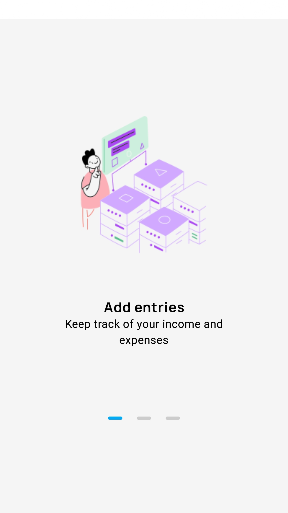
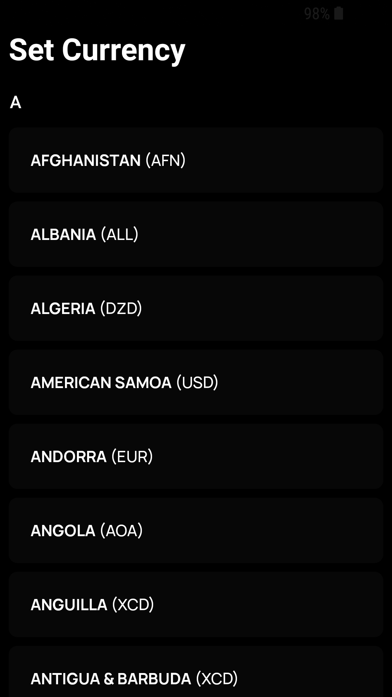

# Wallet
Wallet is a modern budge tracker that keeps track of your monetary activities. Build with kotlin and clean architecture + MVVM adhering to solid clean architecture principles.
Add income and expenses to see where you're spending with an informative chart that tells you a percentage of each expense.
Three different accounts (Card, Cash, Pix - "Brazilian payment method"), Dark mode and multiple currencies choices!!

## Preview
    
    
 
    
  

## Built With
- [Kotlin](https://kotlinlang.org/) - First class and official programming language for Android development.
- [Coroutines](https://kotlinlang.org/docs/reference/coroutines-overview.html) - For asynchronous and more..
- [Jetpack](https://developer.android.com/topic/libraries/architecture) - Collection of libraries that help you design robust, testable, and maintainable apps.
    - [ViewModel](https://developer.android.com/topic/libraries/architecture/viewmodel) - Stores UI-related data that isn't destroyed on Configuration changes.
    - [Room](https://developer.android.com/topic/libraries/architecture/room) - SQLite object mapping library.
    - [Jetpack Navigation](https://developer.android.com/guide/navigation) - Navigation refers to the interactions that allow users to navigate across, into, and back out from the different pieces of content(fragments) within your app
    - [Jetpack Compose](https://developer.android.com/jetpack/compose) - latest reactive ui toolkit by Google
- [Hilt](https://developer.android.com/training/dependency-injection/hilt-android) - for dependency injection
- [MVVM](https://en.wikipedia.org/wiki/Model%E2%80%93view%E2%80%93viewmodel) architecture
- [Android Architecture components](https://developer.android.com/topic/libraries/architecture) ([ViewModel](https://developer.android.com/topic/libraries/architecture/viewmodel) [Compose navigation](https://developer.android.com/jetpack/compose/navigation))
- [Android KTX](https://developer.android.com/kotlin/ktx) - Jetpack Kotlin extensions

## Build-tool
You need to have [Android Studio](https://developer.android.com/studio/preview) to build this project.
